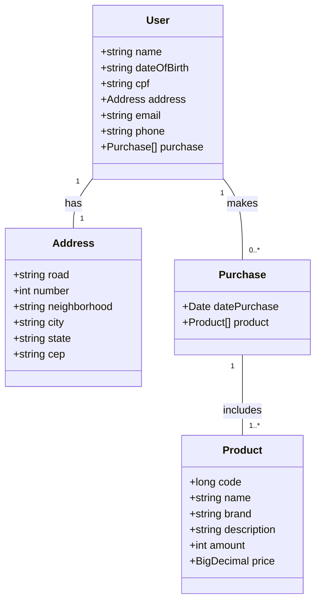

# Publicando API RESTful na Nuvem Usando Spring Boot, Java e Railway.

```mermaid
classDiagram
    class User {
        +string name
        +string dateOfBirth
        +string cpf
        +Address address
        +string email
        +string phone
        +Purchase[] purchase
    }

    class Address {
        +string road
        +int number
        +string neighborhood
        +string city
        +string state
        +string cep
    }

    class Product {
        +long code
        +string name
        +string brand
        +string description
        +int amount
        +BigDecimal price
    }

    class Purchase {
        +Date datePurchase
        +Product[] product
    }

    User "1" -- "1" Address : has
    User "1" -- "0..*" Purchase : makes
    Purchase "1" -- "1..*" Product : includes
```
